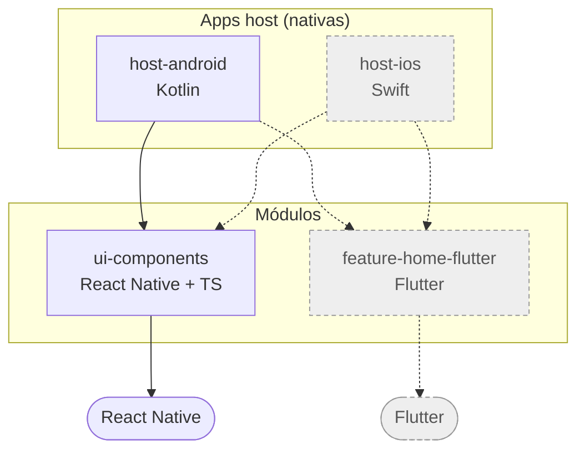

# Arquitectura: apps y módulos

Dependencias de alto nivel. Una flecha `A --> B` significa "A usa B".
Las líneas punteadas y los nodos grises son componentes previstos que aún están vacíos.

```mermaid
flowchart TD
    subgraph Apps["Apps host (nativas)"]
        Android["host-android<br/>Kotlin"]
        iOS["host-ios<br/>Swift"]:::planned
    end

    subgraph Modules["Módulos"]
        UI["ui-components<br/>React Native + TS"]
        Home["feature-home-flutter<br/>Flutter"]:::planned
    end

    RN(["React Native"])
    Flutter(["Flutter"]):::planned

    Android --> UI
    Android -.-> Home
    iOS -.-> UI
    iOS -.-> Home

    UI --> RN
    Home -.-> Flutter

    classDef planned fill:#eee,stroke:#999,stroke-dasharray: 4 3,color:#555
```
